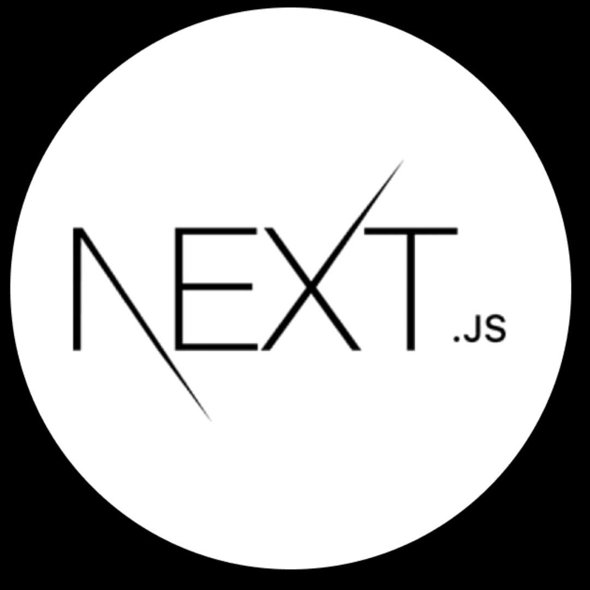
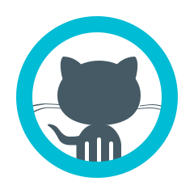

![MasterHead] 

<h1 align="center">Hi 👋, I'm Mahdi Mohammadi</h1>
<h3 align="center">A passionate frontend developer from Afghanistan</h3>

  

    
- 🌱 I’m currently learning **Next.js**

- 💬 Ask me about **HTML, CSS, Bootstrap,tailwinds, Javascript, React, Next.js**

- 📫 How to reach me **mahdi202201.mohammadi@gmail.com**

- ⚡ Fun fact **I am Funny**

<h3 align="left">Connect with me:</h3>

<h3 align="left">Languages and Tools:</h3>

 

 

</a>

 

My Projects

| No  | Project Name    | Github Repository                                                           | View Online                                            |
| --- | --------------- | --------------------------------------------------------------------------- | ------------------------------------------------------ |
| 16  | Issue-tracker   | [repository](https://github.com/MahdiMohammadi98125/issue-tracker)          | [visit](https://issue-tracker-seven-black.vercel.app/) |
| 15  | Game-hub        | [repository](https://github.com/MahdiMohammadi98125/game-hub)               | [visit](https://game-hub-tau-gules.vercel.app/)        |
| 14  | Expense tracker | [repository](https://github.com/MahdiMohammadi98125/expense-tracker-app)    | [visit](https://expense-tracker-app-f390.netlify.app/) |
| 13  | Meetups         | [repository](https://github.com/MahdiMohammadi98125/Meetup-project)         | [visit](https://meetup-project-3b48b6.netlify.app/)    |
| 12  | online service  | [repository](https://github.com/MahdiMohammadi98125/online-service)         | [visit](https://online-service-42520e.netlify.app)     |
| 11  | Mapty           | [repository](https://github.com/MahdiMohammadi98125/Mapty)                  | [visit](https://mapty-seven-pi.vercel.app)             |
| 10  | eat-n-split     | [repository](https://github.com/MahdiMohammadi98125/eat-n-split)            | [visit](https://eat-n-split-40b333.netlify.app/)       |
| 09  | css-variables   | [repository](https://github.com/MahdiMohammadi98125/css-variables)          | [visit](https://css-variables-theta.vercel.app/)       |
| 08  | Drum kit        | [repository](https://github.com/MahdiMohammadi98125/Drum-Kit)               | [visit](https://drum-kit-mu-wine.vercel.app/)          |
| 07  | Pig-Game        | [repository](https://github.com/MahdiMohammadi98125/pig-game)               | [visit](https://pig-game-435c45.netlify.app)           |
| 06  | Guess number    | [repository](https://github.com/MahdiMohammadi98125/Guess-the-number)       | [visit](https://guess-number-8b1de8.netlify.app)       |
| 05  | Bankist Website | [repository](https://github.com/MahdiMohammadi98125/Bankist-Website)        | [visit](https://bankist-website-4cc7be.netlify.app)    |
| 04  | Nexter          | [repository](https://github.com/MahdiMohammadi98125/Nexter-Project)         | [visit](https://nexter-project-5dfc1e.netlify.app)     |
| 03  | Trillo          | [repository](https://github.com/MahdiMohammadi98125/Trillo-Project)         | [visit](https://trillo-project-d13a90.netlify.app)     |
| 02  | Grocery-website | [repository](https://github.com/MahdiMohammadi98125/Grocery-website)        | [visit](https://grocery-website-amber.vercel.app/)     |
| 01  | Omnifood        | [repository](https://github.com/MahdiMohammadi98125/OMNI-FOOD-OPTIMIZATION) | [visit](https://omnifood-mahdi98125.netlify.app/)      |

&nbsp;

